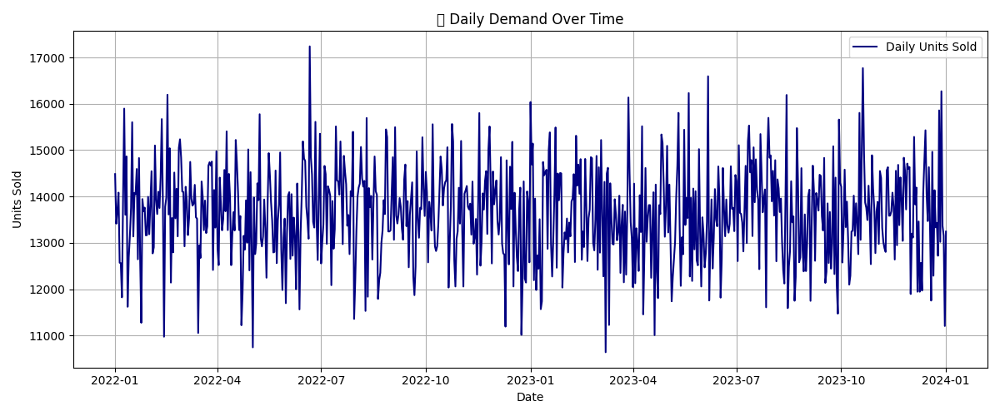
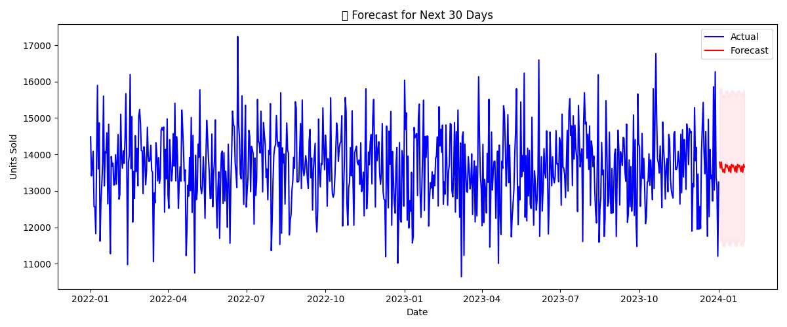

# odeClauseInternship_DemandForecasting
This project utilizes a real-world retail dataset to forecast daily demand using the SARIMAX model. The workflow includes:  - Data exploration and preprocessing - Time series creation and visualization - Building and training a SARIMAX model - Forecasting future demand - Visualizing the results
# 📦 Demand Forecasting for a Retail Store

> **Internship Project ID:** #CC69852  
> **Internship Domain:** Data Science  
> **Project Level:** Intermediate  
> **Internship Provider:** CodeClause  

---

## 🎯 Aim

Develop a time series forecasting model to predict the demand for products in a retail store using historical sales data.

---

## 📄 Description

This project utilizes a real-world retail dataset to forecast daily demand using the SARIMAX model. The workflow includes:

- Data exploration and preprocessing
- Time series creation and visualization
- Building and training a SARIMAX model
- Forecasting future demand
- Visualizing the results

---

## 🛠️ Technologies Used

- Python 
- Pandas  
- Seaborn  
- Matplotlib  
- Statsmodels (SARIMAX)

---

## 📊 Dataset Summary

- **File Name:** `retail_sales.csv`  
- **Records:** 73,100 rows  
- **Columns:** 15 (Date, Store ID, Product ID, Units Sold, Price, Seasonality, etc.)

---

## 🚀 Project Workflow

1. Load and inspect dataset ✅  
2. Clean and preprocess data ✅  
3. Convert `Date` column to datetime ✅  
4. Aggregate daily demand ✅  
5. Visualize demand over time ✅  
6. Train SARIMAX time series model ✅  
7. Forecast next 30 days ✅  
8. Save forecast plot ✅

---

##  Visualizations

### Daily Demand Over Time

### 30-Day Forecast

---

##  Outcome

The model successfully forecasts demand for the next 30 days using historical trends and seasonality. This can assist retail managers in:

- Inventory planning  
- Marketing strategies  
- Resource allocation  

---

##  Acknowledgement

This project was developed as part of the **CodeClause Internship - July 2025 Batch**.  
Completion of this project contributes toward internship certification and learning.

---

##  Note

> This project was completed using VS Code and Python 3.10.  
> All dependencies are standard and can be installed via `pip`.

---

